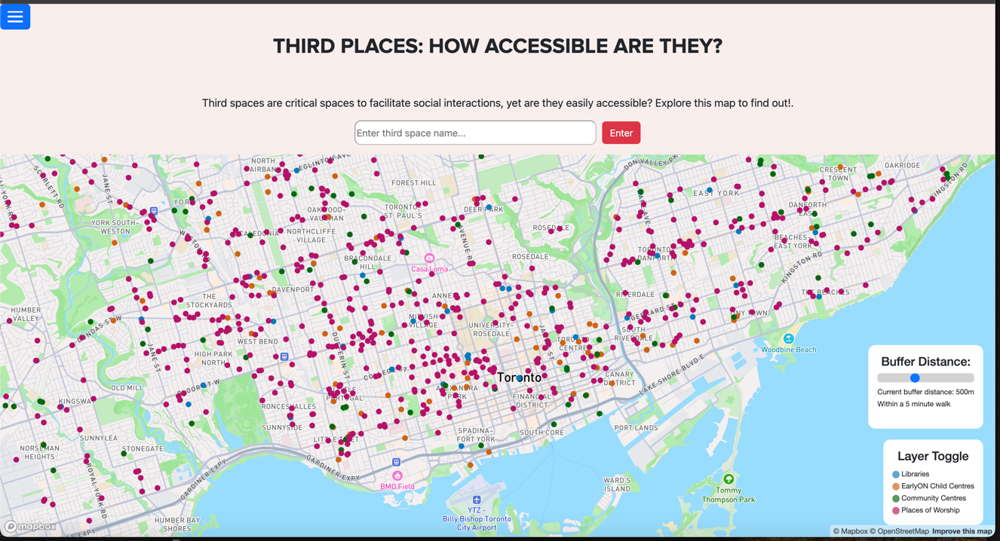
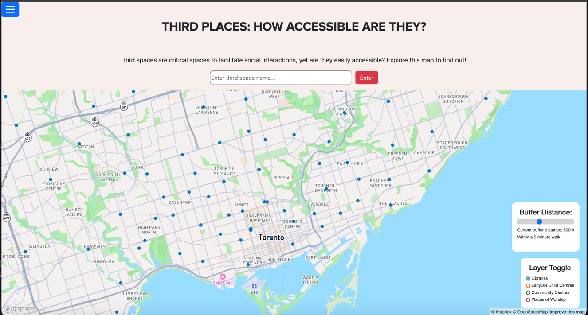
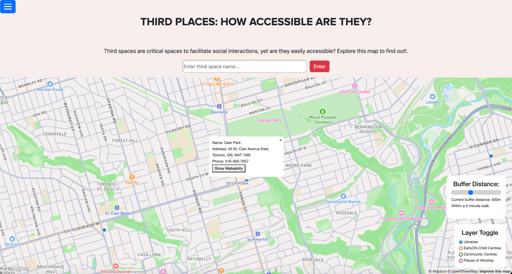
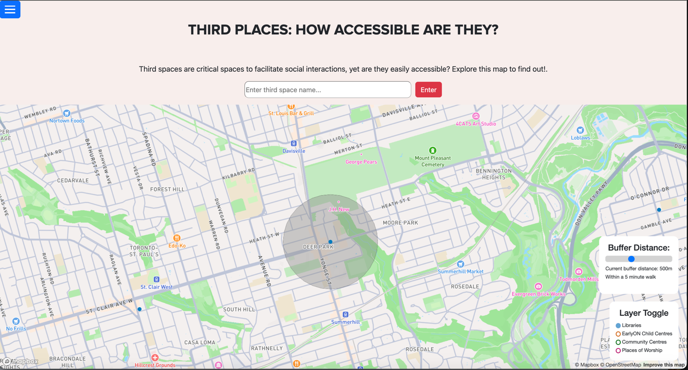

# Introduction

Welcome to **Third Spaces Inc.**!

Our organization's mission is to raise awareness regarding the importance of third place access throughout the city of Toronto.

Third places refer to venues where people congregate for causal socialization outside a home (first place) or school/workplace (second place).

In this project there are two maps, the main map is called **Third Space Access** and the
bonus map is called **Neighbourhood Clusters**. Proceed to the ___ section to learn more about these maps!


---
# Libraries

This project has utilized the following libraries:

- Turf (GIS Analysis)
- Bootstrap (Website Layout)
- Mapbox API (Map Rendering)
- Pandas & GeoPandas (for data cleaning & processing)

---

# Datasets

This table shows all the datasets used for this application:

| Dataset Name                             |                         Description                         | Data Source              |
|------------------------------------------|:-----------------------------------------------------------:|--------------------------|
| ```library.geojson```                    |        Contains data on public libraries in Toronto         | Toronto Open Data Portal |
| ```Places_of_Worship.geojson```          |        Contains data on places of worship in Toronto        | Toronto Open Data Portal |
| ```community_centres.geojson```          |        Contains data on community centres in Toronto        | Toronto Open Data Portal |
| ```EarlyONChildCentres.geojson```        |   Contains data on earlyON child care centers in Toronto    | Toronto Open Data Portal |
| ```tor_neighbourhoods_updated.geojson``` | Contains data on the 158 neighbourhoods that divide Toronto | Toronto Open Data Portal |

---

# Important Files

This table shows all the important files involved in this application: 

| File Name                        |                                                      Description                                                       |
|----------------------------------|:----------------------------------------------------------------------------------------------------------------------:|
| ```menu.js```                    | Controls the menu logic (expanding and retracting the menu when the user clicks the menu button) for this application  |
| ```third_space_map.js```         |                          Controls the interactive elements of the **Third Space Access** map                           |
| ```neighbourhood_cluster.js```   |                        Controls the interactive elements of the **Neighbourhood Clusters** map                         |
| ```index.html```                 |                              Controls the structure of the **Background** (landing) page                               |
| ```third_space_access.html```    |                               Controls the structure of the **Third Space Access** page                                |
| ```neighbourhood_cluster.html``` |                             Controls the structure of the **Neighbourhood Clusters** page                              |
| ```style.css```                  | Controls the styling of the website as well as the positioning of webpage elements (e.x. menu, buttons, legends, etc.) |

___

# How To Use

When opened, this website begins at the **Background** page. When the menu is not visible, click on the blue menu button to make it accessible.
When on screen, click the menu button again to retract the menu. 

// add images of menu expanding and retracting here.

## The Background Page

The background page defines third places, why they are significant, and the rationale behind the **Third Spaces Inc.* application. You can click on the 
references at the bottom of the page for more expository information on the topic.

## Third Space Map

The **Third Space Map** is intended to help users learn about the distribution of third places throughout Toronto, and the accessibility of third places in their 
area (if they reside in or near Toronto). The map contains colored points. Each point color represents a different type of third place, which the ```layer toggle``` legend 
explains. By default, all third place types are toggled on. However, at any time, the user can toggle on/off third place layers. See the below images for examples:

|       Default Appearance       |                Only Libraries                |
|:------------------------------:|:--------------------------------------------:|
|  |  |

Click on any point on the map to learn more about that specific third space. Once the pop-up renders, you can either close the pop-up 
or click the ```Show Walkability``` button, which will display a buffer around the point. This removes the pop-up.

|                  Third Place Pop Up                  |                        Third Place Walkability Buffer                        |
|:----------------------------------------------------:|:----------------------------------------------------------------------------:|
|  |  |

By default, all buffers are 500m. However, the buffer distance slider can be used to dynamically set the distance of a buffer. See the below images 
for an example of how the slider affects buffers.

| 250m Buffer | 500m Buffer (Default) | 750m Buffer |
|-------------|:---------------------:|-------------|
|             |                       |             |
